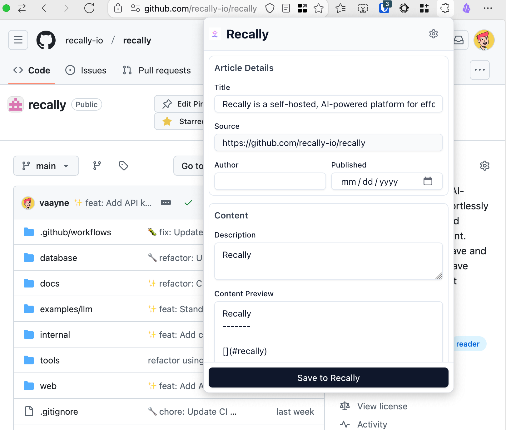
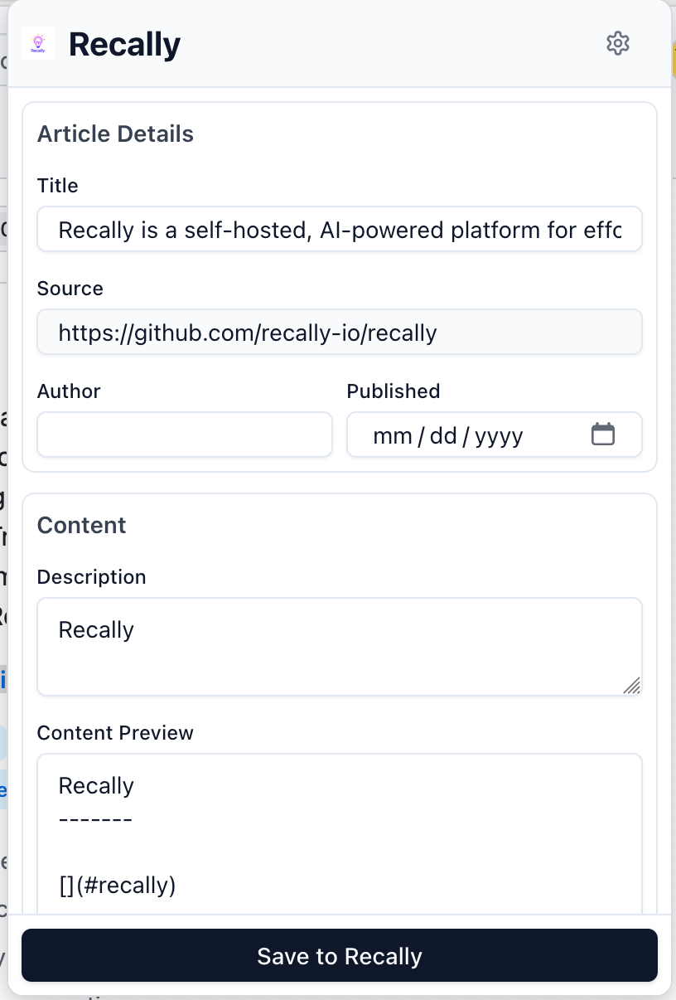
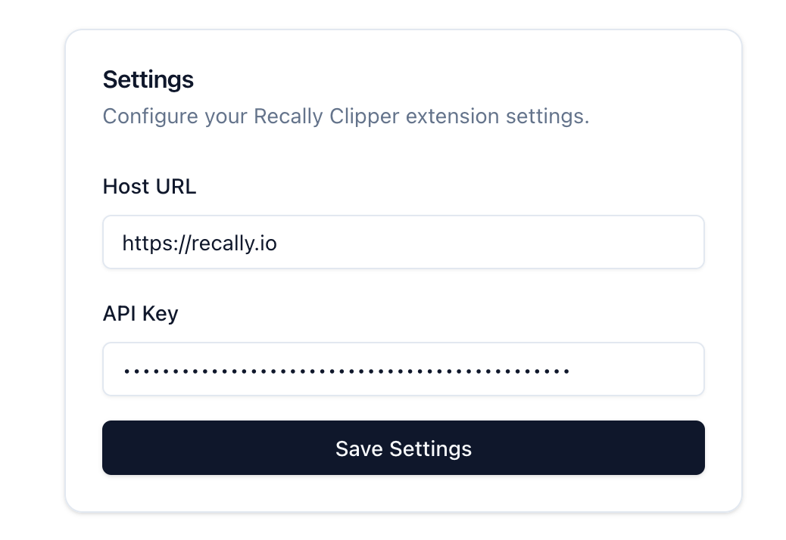

# Recally Clipper · [](LICENSE)

[](https://github.com/recally-io/recally-clipper/releases)
[](https://github.com/recally-io/recally-clipper/releases)

Your intelligent web companion for capturing, organizing, and rediscovering content. The Recally Clipper browser extension integrates seamlessly with [Recally](https://recally.io) to transform how you save and manage web content.

## ✨ Key Features

- 🚀 Quick web page clipping
  - Save entire pages
  - Auto-extract main content
  - Preserve formatting and styles
- 💾 Seamless Recally Integration
  - One-click save to your Recally account
  - Automatic sync across devices
  - Smart tag suggestions
- 🎨 Modern User Experience
  - Clean and intuitive interface
  - Dark/light mode support
  - Keyboard shortcuts
- 🌐 Cross-browser Support
  - Chrome & Chromium-based browsers
  - Firefox
  - Safari (manual installation)

## 🌐 Universal Browser Support
| Browser           | Status                          |
|-------------------|---------------------------------|
| Chrome/Edge/Brave | [Web Store](https://chrome.google.com/webstore/detail/heblpkdddipfjdpdgikoledoecohoepp)      |
| Firefox           | [Add-ons](https://addons.mozilla.org/addon/recally-clipper/)        |
| Safari            | [Manual Install](#safari-setup) |

## 📸 ## Screenshots

| Browser Interface | Popup Page | Extension Settings |
|-------------------|-----------------| -----------------|
|  |  |  |

## 🚀 Getting Started

### Requirements
- [Recally](https://github.com/recally-io/recally) account
- Supported browser (Chrome 90+, Firefox 89+, Safari 15+)

### Safari Setup:
```bash
# Clone repository
git clone https://github.com/recally-io/recally-clipper.git
cd recally-clipper

# Install dependencies & build
bun install
bun run build:safari

# Enable extension in Safari:
# 1. Open Safari Preferences → Extensions
# 2. Enable "Recally Clipper"
# 3. Grant requested permissions
```

## 🛠 Development Guide

### Prerequisites
- [Bun](https://bun.sh) v1.0.0+
- Node.js v18+
- Chromium-based browser for testing

### Workflow
```bash
# Install dependencies
bun install

# Start dev server with hot-reload
bun run dev

# Production build (outputs to dist/)
bun run build

# Run Vitest unit tests
bun test

# Lint with ESLint
bun run lint

# Package for store submission
bun run zip
```

**Loading in Browser:**
1. After `bun run dev`, open `chrome://extensions`
2. Enable "Developer mode"
3. Click "Load unpacked" → select `dist/chrome-mv3`

## 🤝 Contributing

We welcome contributions! Please review our [contribution guidelines](CONTRIBUTING.md) before proceeding.

1. Fork the repository
2. Create a feature branch (`git checkout -b feat/your-feature`)
3. Commit changes following [Conventional Commits](https://www.conventionalcommits.org) spec
4. Push to branch (`git push origin feat/your-feature`)
5. Open a Pull Request with detailed description

### Issue Tracking
- 🐛 Bugs: [Open Issue](https://github.com/recally-io/recally-clipper/issues/new?template=bug_report.md)
- 💡 Feature Requests: [Suggest Idea](https://github.com/recally-io/recally-clipper/issues/new?template=feature_request.md)

## 📬 Support

For assistance, contact our team:
- 🚨 Emergency Support: support@recally.io (response <4hrs)
- 💬 Community Forum: [Recally Discussions](https://github.com/recally-io/recally/discussions)
- 🐦 Social Media: [@recally_io](https://twitter.com/recally_io)

## 📄 License

MIT Licensed - See [LICENSE](LICENSE) for full text.

---

*Recally Clipper v2.1.0 | Documentation updated 2025-01-21*
