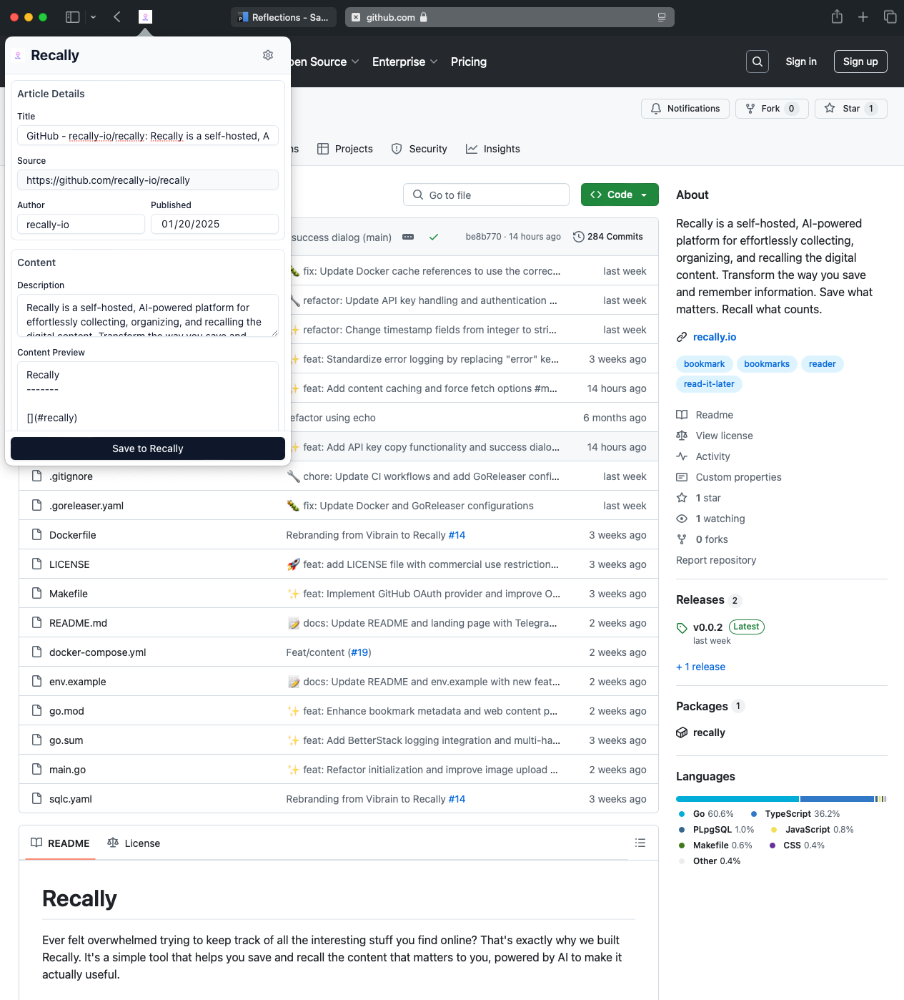

# Recally Clipper

A browser extension that seamlessly integrates with [Recally](https://recally.io) to help you save and organize web content. Built with modern technologies including WXT and shadcn/ui.

## Features

- 🚀 Quick web page clipping
- 💾 Save to Recally with one click
- 🎨 Clean and intuitive interface
- 🌐 Support for Chrome, Firefox, and Safari
- ⚙️ Customizable options

## Screenshots





## Installation

### Chrome/Firefox
1. Visit the extension store
2. Search for "Recally Clipper"
3. Click "Add to Browser"

### Safari
1. Download from the Mac App Store
2. Enable the extension in Safari preferences

## Development

### Prerequisites
- bun

### Setup
```bash
# Install dependencies
bun install

# Start development server
bun run dev

# Build for production
bun run build
```

## License

MIT License
